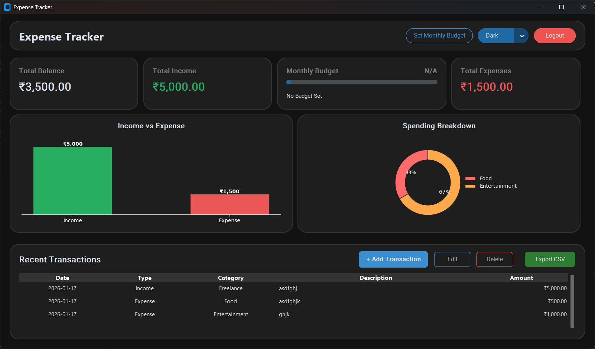
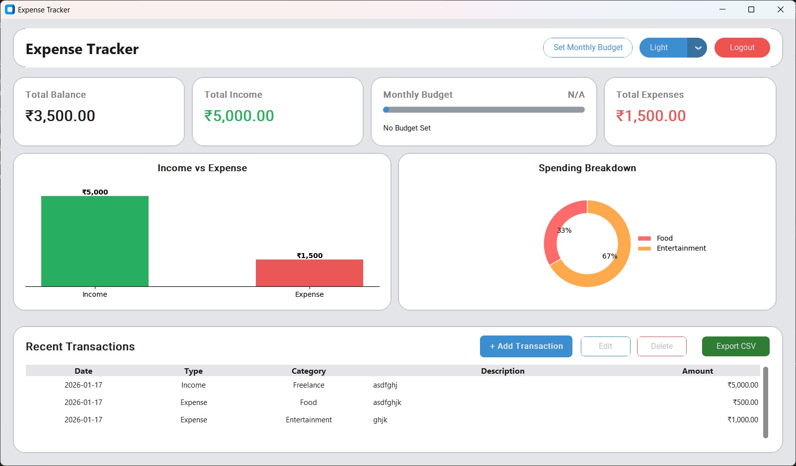

# 💰 Modern Expense Tracker GUI

A modern, glassmorphism-styled Expense Tracker application built with Python and CustomTkinter. It features local SQLite authentication, visual analytics, and monthly budgeting.

## ✨ Features

* **GUI:** Modern interface with "Glassmorphism" cards and Dark/Light mode toggle.
* **Authentication:** Secure Login/Register system with hashed passwords.
* **Dashboard:** Real-time summary of Balance, Income, and Expenses.
* **Analytics:** Interactive Bar Charts and Pie Charts using Matplotlib.
* **Budgeting:** Set monthly limits with visual progress bars and over-budget alerts.
* **Data Management:** Add, Edit, Delete transactions and **Export to CSV**.
* **Database:** Local `sqlite3` storage (no internet required).

## 🛠️ Installation

1.  **Clone the repository**
    ```bash
    git clone https://github.com/pattanayakpratik/Expense-Tracker-GUI.git
    cd Expense-Tracker-GUI
    ```

2.  **Install Dependencies**
    ```bash
    pip install -r requirements.txt
    ```

3.  **Run the App**
    ```bash
    python main.py
    ```

## 📦 Dependencies
* `customtkinter`
* `matplotlib`
* `tkcalendar`
* `sqlite3` (Standard Lib)

## 📷 Screenshots
* DARK MODE

* LIGHT MODE


---
Built with 💙 by *Pratik Pattanayak* using Python.
